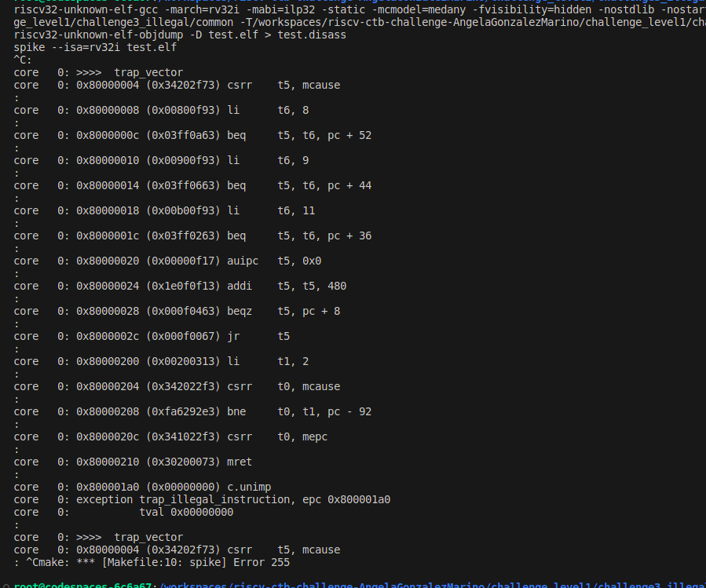
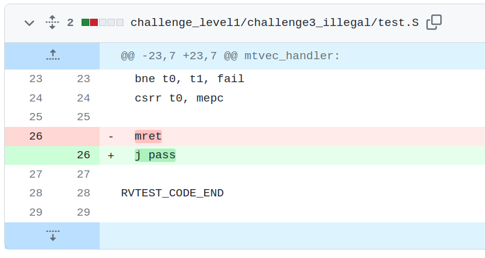

**Error** After encountering an illegal instruction, the test was returning to the illegal instruction again (using mret), causing an infinite loop.

See the execution of the problem below:

The solution is to jump to PASS, once the illegal instruction has been correctly indentified.

