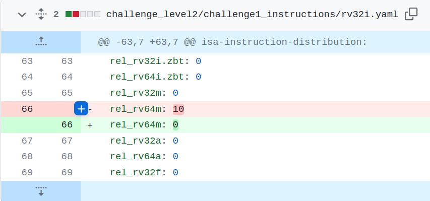

The test configuration was using rv64m instructions, which are not supported in RV32I, and throwing these kind of errors.

test.S:1152: Error: unrecognized opcode `mulw t5,s3,a3'
test.S:1155: Error: unrecognized opcode `divuw s0,a4,t0'
test.S:1159: Error: unrecognized opcode `mulw s0,a1,s6'
test.S:1162: Error: unrecognized opcode `mulw s8,t3,a7'
test.S:1176: Error: unrecognized opcode `divuw s8,t5,s8'
test.S:1177: Error: unrecognized opcode `divuw t6,s0,s0'
test.S:1179: Error: unrecognized opcode `remw t4,s8,s8'
test.S:1184: Error: unrecognized opcode `remuw a7,s8,s0'
test.S:1191: Error: unrecognized opcode `divw zero,s8,s0'
test.S:1192: Error: unrecognized opcode `remw s0,s0,s8'
test.S:1194: Error: unrecognized opcode `mulw t5,s3,zero'
test.S:1199: Error: unrecognized opcode `mulw s0,t3,s4'
test.S:1205: Error: unrecognized opcode `mulw s0,t6,s6'
test.S:1208: Error: unrecognized opcode `remuw t5,t5,t5'
test.S:1211: Error: unrecognized opcode `remw a5,t5,s0'
test.S:1219: Error: unrecognized opcode `mulw s10,s8,s8'
test.S:1222: Error: unrecognized opcode `divuw zero,s4,t0'
test.S:1243: Error: unrecognized opcode `remw s0,t2,zero'
test.S:1247: Error: unrecognized opcode `mulw s3,a3,s6'
test.S:1255: Error: unrecognized opcode `mulw a2,s8,s8'
test.S:1261: Error: unrecognized opcode `remw t5,t5,s0'
test.S:1263: Error: unrecognized opcode `mulw a6,s0,s0'
test.S:1264: Error: unrecognized opcode `divw s1,s0,s0'
test.S:1268: Error: unrecognized opcode `divw a6,a3,s4'
test.S:1270: Error: unrecognized opcode `remuw s6,s11,zero'

By not using these instructions the test passes correctly. 

