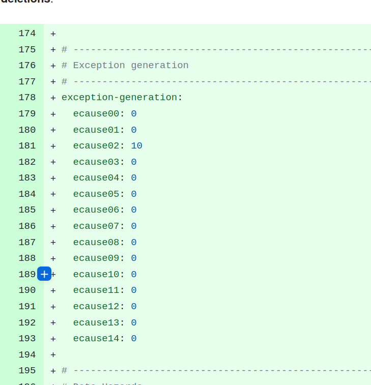
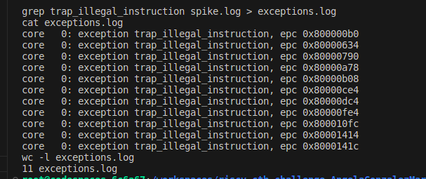

New rv32i.yaml file created, with "ecause02: 10" in the exceptions generation area.

With this, the exceptions are generated and captured correctly. There is one extra exception generated at the beginning of the test that is always there, even if ecause02: 00 in yaml file.

