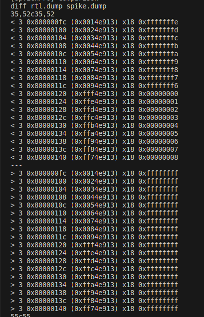
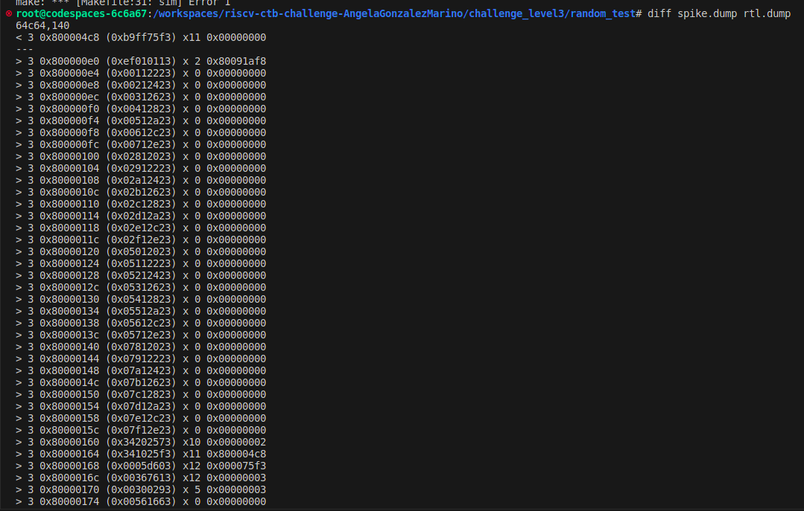
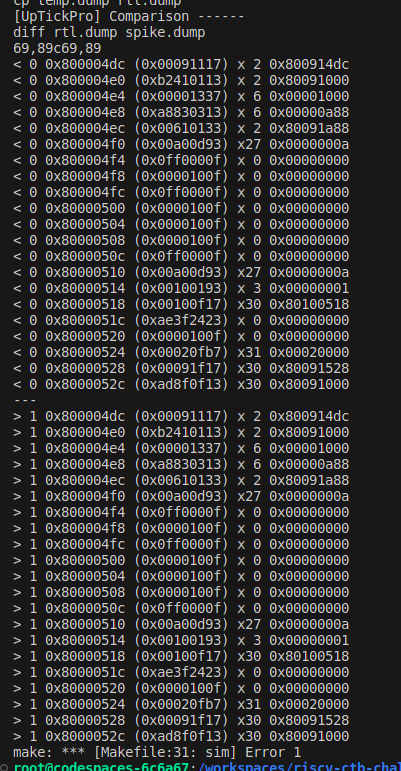

* Bug 1 
- or and ori instructions not working properly. 
    - it seems that instead of result = A or B, it is performed result = not (A and B)
    - test file: test-error-or.S

** Bug 2 **
- illegal instruction trap managed in a different way. 
    - the model is just omitting the illegal instruction, while the DUT is executing a trap sequence
    -test file: test-error-trap.S (this test was initially generated with aapg and the manually modified, so the aapg generated files are required to run it)

    

** Bug 3**
- Supervisor mode is not correctly set. Instead user mode is set.
    -test file: test-error-s-mode.S (this test was initially generated with aapg and the manually modified, so the aapg generated files are required to run it)

